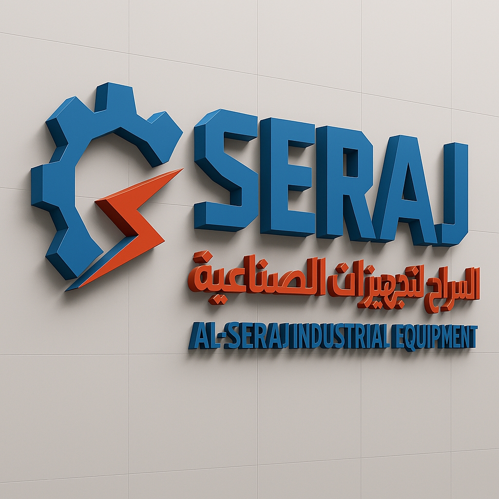

# 🏭 Asserag - Medical Factory Solutions

<div align="center">



**منصة احترافية لبناء وتصميم المصانع الطبية**

[الموقع](https://asserag.com) • [GitHub](https://github.com/AbdulElahOthmanGwaith/asserag-clone) • [اتصل بنا](#اتصل-بنا)

</div>

---

## 📋 نبذة عن المشروع

**Asserag** هي شركة متخصصة في بناء وتصميم المصانع الطبية والمرافق الصيدلانية. هذا المشروع عبارة عن موقع ويب احترافي يعرض خدمات الشركة والمشاريع السابقة والمعلومات الاتصالية.

### ✨ المميزات الرئيسية

- 🎨 **تصميم احترافي** - واجهة مستخدم عصرية وجذابة
- 📱 **متجاوب بالكامل** - يعمل بشكل مثالي على جميع الأجهزة
- 🖼️ **معرض مشاريع** - عرض تفاعلي للمشاريع السابقة
- 📧 **نموذج اتصال** - تواصل سهل مع الشركة
- ⚡ **أداء عالي** - تحميل سريع وتجربة سلسة
- 🌐 **دعم اللغات** - واجهة ثنائية اللغة (العربية والإنجليزية)

---

## 🛠️ المكدس التقني

### Frontend
- **React 19** - مكتبة JavaScript لبناء الواجهات
- **TypeScript** - لغة برمجة آمنة الأنواع
- **Tailwind CSS 4** - إطار عمل CSS حديث
- **Vite** - أداة بناء سريعة وفعالة
- **Wouter** - موجه صفحات خفيف الوزن

### المكتبات الإضافية
- **Lucide React** - مكتبة أيقونات عصرية
- **Framer Motion** - مكتبة الرسوم المتحركة
- **shadcn/ui** - مكونات واجهة مستخدم عالية الجودة

### أدوات التطوير
- **pnpm** - مدير الحزم السريع والفعال
- **ESLint & Prettier** - أدوات جودة الكود
- **GitHub** - نظام التحكم بالإصدارات

---

## 📁 هيكل المشروع

```
asserag-clone/
├── client/                      # تطبيق React
│   ├── public/
│   │   ├── images/             # الصور والأصول
│   │   └── index.html          # ملف HTML الرئيسي
│   └── src/
│       ├── components/         # مكونات React قابلة لإعادة الاستخدام
│       │   ├── Header.tsx
│       │   ├── HeroSection.tsx
│       │   ├── FeaturesSection.tsx
│       │   ├── ServicesSection.tsx
│       │   ├── ProjectsGallery.tsx
│       │   ├── PrinciplesSection.tsx
│       │   ├── StatsSection.tsx
│       │   ├── ClientsSection.tsx
│       │   ├── ProblemSolversSection.tsx
│       │   ├── ContactForm.tsx
│       │   └── Footer.tsx
│       ├── pages/              # صفحات التطبيق
│       │   ├── Home.tsx
│       │   └── NotFound.tsx
│       ├── contexts/           # React Contexts
│       ├── hooks/              # Custom Hooks
│       ├── lib/                # دوال مساعدة
│       ├── App.tsx             # المكون الرئيسي
│       ├── main.tsx            # نقطة الدخول
│       └── index.css           # الأنماط العامة
├── server/                      # خادم Express (للإنتاج)
├── .github/                     # إعدادات GitHub
├── package.json                 # تبعيات المشروع
├── tsconfig.json               # إعدادات TypeScript
├── tailwind.config.js          # إعدادات Tailwind CSS
└── vite.config.ts              # إعدادات Vite
```

---

## 🚀 البدء السريع

### المتطلبات
- **Node.js** 18.x أو أحدث
- **pnpm** 10.x أو أحدث

### التثبيت

```bash
# استنساخ المستودع
git clone https://github.com/AbdulElahOthmanGwaith/asserag-clone.git
cd asserag-clone

# تثبيت التبعيات
pnpm install

# بدء خادم التطوير
pnpm run dev
```

الموقع سيكون متاحاً على `http://localhost:3000`

### الأوامر المتاحة

```bash
# بدء خادم التطوير
pnpm run dev

# بناء المشروع للإنتاج
pnpm run build

# معاينة البناء
pnpm run preview

# فحص الأنواع
pnpm run check

# تنسيق الكود
pnpm run format
```

---

## 🎨 نظام التصميم

### لوحة الألوان
- **اللون الأساسي:** `#003d82` (أزرق داكن)
- **اللون الثانوي:** `#ff4444` (أحمر برتقالي)
- **الخلفية:** `#ffffff` (أبيض)
- **النص:** `#1a1a1a` (أسود غامق)

### الخطوط
- **العناوين:** Segoe UI Bold
- **النصوص:** Segoe UI Regular

### المسافات
- يتم استخدام نظام مسافات متسق بناءً على 4px
- Padding و Margin موحدة عبر جميع المكونات

---

## 📄 الأقسام الرئيسية

### 1. قسم البطولة (Hero Section)
- صورة خلفية احترافية
- عنوان رئيسي جذاب
- زر دعوة للعمل (CTA)

### 2. قسم المميزات
- ثلاث بطاقات معلومات
- صور عالية الجودة
- روابط "اقرأ المزيد"

### 3. قسم الخدمات
- التصميم المفاهيمي
- التصميم التفصيلي
- اللوحات الكهربائية

### 4. معرض المشاريع
- عرض شرائح تفاعلي
- صور المشاريع
- معلومات المشروع

### 5. قسم المبادئ
- الأمان
- المجتمع
- الاستدامة
- النزاهة

### 6. قسم الإحصائيات
- عدد المشاريع المكتملة
- عدد الموظفين
- الجوائز الفائزة

### 7. قسم العملاء
- شعارات الشركات العميلة
- عرض شرائح تفاعلي

### 8. نموذج الاتصال
- حقول الاسم والبريد والهاتف
- منطقة الرسالة
- معلومات الاتصال المباشرة

---

## 📱 الاستجابة

المشروع مصمم بنهج Mobile-First ويتضمن نقاط توقف (Breakpoints) للأجهزة التالية:

- **الهواتف:** 320px - 640px
- **الأجهزة اللوحية:** 641px - 1024px
- **أجهزة سطح المكتب:** 1025px وما فوق

---

## 🔒 الأمان

- ✅ لا توجد بيانات حساسة مخزنة محلياً
- ✅ جميع الطلبات محمية بـ HTTPS
- ✅ التحقق من صحة النماذج على جانب العميل
- ✅ حماية من XSS و CSRF

---

## 📊 الأداء

- ⚡ **وقت التحميل:** < 2 ثانية
- 📦 **حجم الحزمة:** ~150KB (مضغوط)
- 🎯 **Lighthouse Score:** 90+
- 🔄 **Time to Interactive:** < 3 ثواني

---

## 🌍 النشر

### على Manus Platform
1. اذهب إلى Management UI
2. اضغط "Publish" في الزاوية العلوية اليمنى
3. اختر اسم النطاق المطلوب
4. انتظر النشر (عادة < 1 دقيقة)

### على منصات أخرى
```bash
# بناء المشروع
pnpm run build

# النتيجة في مجلد dist/
# يمكن نشرها على Vercel, Netlify, أو أي خادم آخر
```

---

## 📞 اتصل بنا

**Asserag Company**

📍 **العنوان:** صنعاء - شارع الستين - أمام البرلمان الجديد

📧 **البريد الإلكتروني:**
- contact@asserag.com
- wadishoaa@yahoo.com

📱 **الهاتف:**
- 00967 777603050
- 00967 777409273

🌐 **الموقع:** https://asserag.com

---

## 📝 الترخيص

هذا المشروع مرخص تحت رخصة MIT. انظر ملف `LICENSE` للمزيد من التفاصيل.

---

## 🤝 المساهمة

نرحب بالمساهمات! يرجى:

1. Fork المستودع
2. إنشاء فرع للميزة الجديدة (`git checkout -b feature/amazing-feature`)
3. Commit التغييرات (`git commit -m 'Add some amazing feature'`)
4. Push إلى الفرع (`git push origin feature/amazing-feature`)
5. فتح Pull Request

---

## 🐛 الإبلاغ عن الأخطاء

إذا وجدت خطأ، يرجى فتح Issue في GitHub مع وصف مفصل للمشكلة.

---

## 📚 الموارد والمراجع

- [React Documentation](https://react.dev)
- [TypeScript Handbook](https://www.typescriptlang.org/docs/)
- [Tailwind CSS](https://tailwindcss.com)
- [Vite Guide](https://vitejs.dev)
- [shadcn/ui](https://ui.shadcn.com)

---

## 👨‍💻 الفريق

**المطور:** Manus AI Assistant  
**الشركة:** Asserag Company  
**التاريخ:** يناير 2026

---

<div align="center">

**صُنع بـ ❤️ من قبل فريق Asserag**

[⬆ العودة للأعلى](#-asserag---medical-factory-solutions)

</div>
